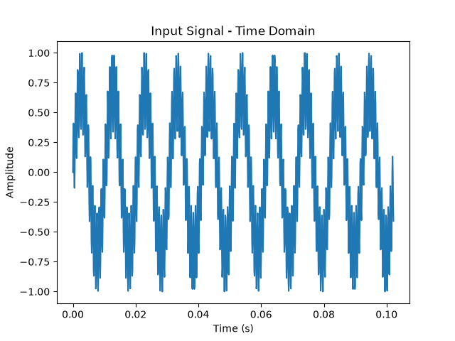
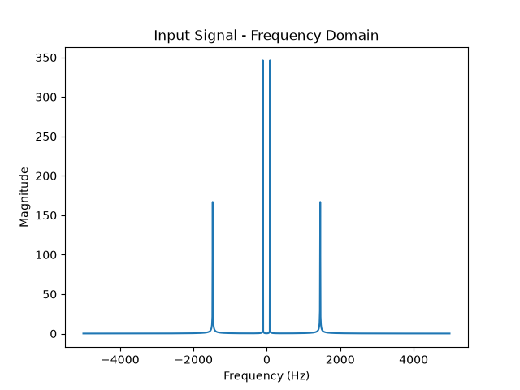
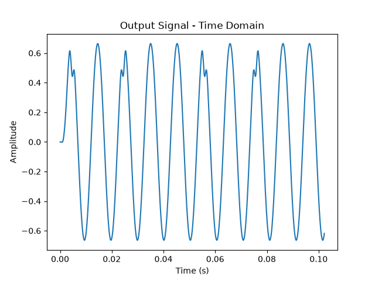
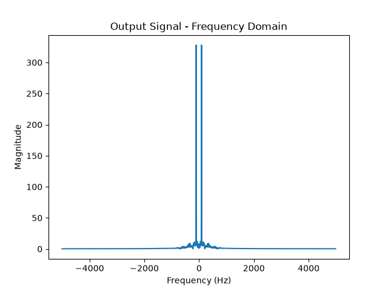

# hdl-journey

A collection of HDL projects built while learning FPGA and digital hardware engineering.

I'm Jack, an ECE student at Virginia Tech interested in FPGA design,
RTL engineering, and DSP. This repo documents my progress learning Verilog through the 
summer of 2026, including a research internship at Maynooth University in Ireland.

## Projects

### FIR Filter (Capstone)
A 32-tap lowpass FIR filter implemented in Verilog on the Basys 3 FPGA with a full UART 
communication pipeline for sending and receiving signal data from a host PC.

- Fixed-point Q15 arithmetic with a pipelined multiply-accumulate architecture
- Resolved a -44ns timing violation by adding pipeline registers to the adder tree, achieving timing closure at 91MHz
- Validated filter behavior against a Python/SciPy reference using FFT analysis
- UART TX and RX modules built from scratch (no IP cores)

**Results** — input vs. filtered output, time and frequency domain. The lowpass
attenuates the higher-frequency tone while passing the near-DC one through:

| | Time domain | Frequency domain |
|---|---|---|
| Input  |  |  |
| Output |  |  |

### UART (UART TX/RX)
Full custom UART transmitter and receiver implemented in Verilog, tested on Basys 3 hardware.

### ALU
Behavioral ALU supporting standard arithmetic and logic operations.

## Tools
- Xilinx Vivado
- Basys 3 FPGA (Artix-7)
- Python (NumPy, SciPy, Matplotlib, PySerial)

## Goals Completed — Summer 2026
- [x] Write Verilog modules and testbenches from scratch
- [x] Deploy designs to FPGA hardware
- [x] Build a DSP pipeline with hardware/software co-validation
- [x] Understand and fix timing violations through pipeline analysis